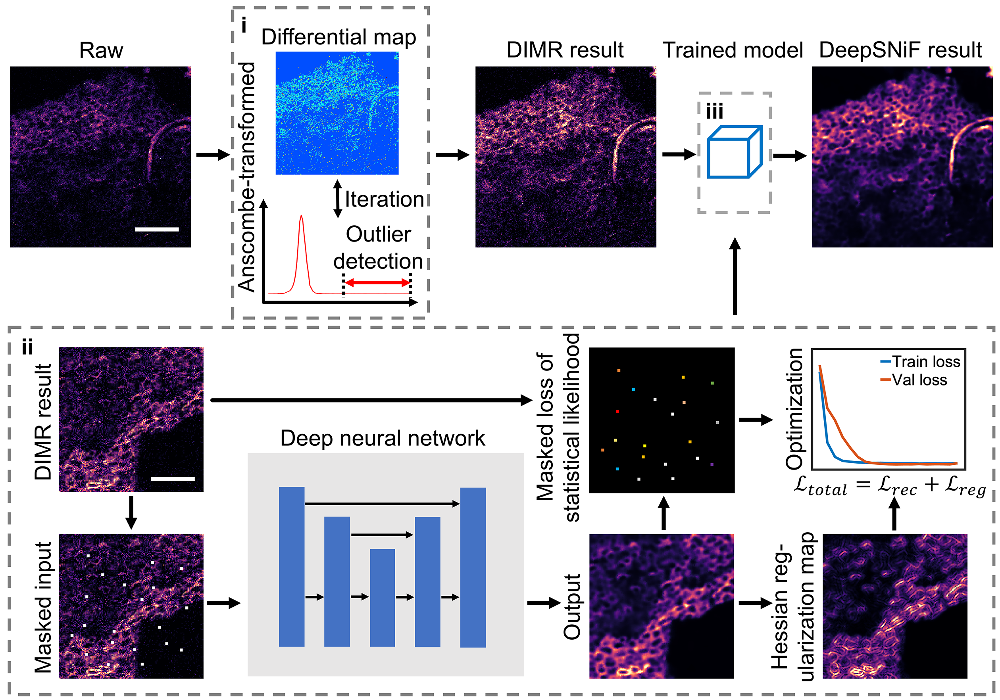
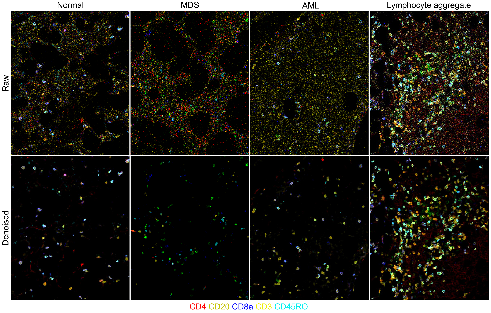

# IMC-Denoise: a content aware denoising pipeline to enhance Imaging Mass Cytometry



Imaging Mass Cytometry (IMC) is an emerging multiplexed imaging technology for analyzing complex microenvironments that has the ability to detect the spatial distribution of at least 40 cell markers. However, this new modality has unique image data processing requirements, particularly when applying this
technology to patient tissue specimens. In these cases, signal-to-noise ratio (SNR) for particular markers can be low despite optimization of staining conditions, and the presence of pixel intensity artifacts can deteriorate image quality and the performance of downstream analysis. Here we demonstrate a content aware
pipeline, IMC-Denoise, to restore IMC images. Specifically, we deploy **(i)** a **D**ifferential **I**ntensity **M**ap-based **R**estoration (**DIMR**) algorithm for removing hot pixels and **(ii, iii)** a self-supervised **Deep** learning algorithm for **S**hot **N**oise **i**mage **F**iltering (**DeepSNiF**). IMC-Denoise enables adaptive hot pixel removal without loss of resolution and delivers significant SNR improvement to a diverse set of IMC channels and datasets. Here we show how to implement IMC-Denoise and develop the software package **IMC_Denoise**. We hope this package could help the researchers in the field of mass cytometry imaging.

## Examples of denoising results from human bone marrow IMC dataset
<p align = "center"><b>Denoise lymphocyte antibody-stained images</b></p>


<p align = "center"><b>Denoise other antibody-stained images</b></p>


## Contents

- [Directory structure of IMC_Denoise](#directory-structure-of-imc_denoise)
- [Customize environment for IMC_Denoise](#customize-environment-for-imc_denoise)
  - [Our IMC_Denoise environment](#our-imc_denoise-environment)
  - [Installation](#installation)
  - [Encountering NaN loss](#encountering-nan-loss)
  - [Docker](#docker)
- [Implement IMC_Denoise](#implement-imc_denoise)
  - [Directory structure of raw IMC images](#directory-structure-of-raw-imc-images)
  - [Steinbock / Multichannel tiff Alternative Directory Structure (new)](#steinbock-multichannel-tiff-alternative-directory-structure) 
  - [Download example data](#download-example-data)
  - [Network structure (new)](#network-structure-new)
  - [Commonly used hyper-parameters of the algorithm](commonly-used-hyper-parameters-of-the-algorithm)
  - [IMC_Denoise tutorials with Jupyter Notebook](#imc_denoise-tutorials-with-jupyter-notebook)
  - [Implement IMC_Denoise with scripts](#implement-imc_denoise-with-scripts)
- [Contact](#contact)
- [References](#references)

## Directory structure of IMC_Denoise
```
IMC_Denoise
|---IMC_Denoise
|---|---IMC_Denoise_main
|---|---|---DIMR.py
|---|---|---DeepSNiF.py
|---|---|---DeepSNiF_model.py
|---|---|---loss_functions.py
|---|---DeepSNiF_utils
|---|---|---DeepSNiF_DataGenerator.py
|---|---|---DeepSNiF_TrainGenerator.py
|---|---Anscombe_transform
|---|---|---Anscombe_transform_functions.py
|---|---|---Anscombe_vectors.mat
|---Jupyter_Notebook_examples
|---|---IMC_Denoise_Train_and_Predict.ipynb
|---|---IMC_Denoise_Train.ipynb
|---|---IMC_Denoise_Predict.ipynb
|---scripts
|---|---Data_generation_DeepSNiF_script.py
|---|---Training_DeepSNiF_script.py
|---|---Generate_data_and_training_DeepSNiF_script.py
|---|---Predict_DIMR_script.py
|---|---Predict_IMC_Denoise_script.py
```
- **IMC_Denoise** implements DIMR and DeepSNiF algorithms to remove hot pixels and filter shot noise in IMC images, respectively.
- **Jupyter Notebooks** and **scripts** include several examples to implement IMC_Denoise algorithms.

## Customize environment for IMC_Denoise
### Our IMC_Denoise environment
- Windows 10 64bit
- Python 3.6
- Tensorflow 2.2.0
- Keras 2.3.1
- NVIDIA GPU + CUDA
- Note that Linux also works with such configurations

### Installation
- Create a virtual environment and install tensorflow-gpu and keras (we run all the codes in a Anaconda Powershell Prompt).
```
$ conda create -n 'IMC_Denoise' python=3.6
$ conda activate IMC_Denoise (some systems recommend: source activate IMC_Denoise)
$ conda install -c anaconda brotlipy
$ pip install tensorflow==2.2.0 keras==2.3.1
$ conda install -c anaconda cudnn=7.6.5 cudatoolkit=10.1.243
$ pip install jupyter
```
- In case above commends do not work, please try:
```
$ conda create -n IMC_Denoise python=3.6 anaconda
$ conda activate IMC_Denoise (some systems recommend: source activate IMC_Denoise)
$ pip install tensorflow==2.2.0 keras==2.3.1
$ conda install -c anaconda cudnn=7.6.5 cudatoolkit=10.1.243
```
- Download the source code and install the package in your folder.
```
$ git clone https://github.com/PENGLU-WashU/IMC_Denoise.git
$ cd IMC_Denoise
$ pip install -e .
```
### Encountering NaN loss
- In case the training losses are NaN, please install the following cuda libraries:
```
conda install -c anaconda cudnn=8.1 cudatoolkit=11.2
```
### Docker
- Use dockerfile provided to build reproducible environment with IMC_Denoise.  
```
$ git clone https://github.com/PENGLU-WashU/IMC_Denoise.git
$ cd IMC_Denoise
$ docker build -t imc_denoise:1.0 . --platform linux/amd64
```
- On LSF cluster to run scripts or jupyter notebooks, respectively:
```
$ LSF_DOCKER_PORTS="8888:8888" bsub -Is -R 'select[gpuhost,port8888=1]' -gpu "num=1:gmodel=TeslaV100_SXM2_32GB" -a 'docker(imc_denoise:1.0)' /bin/bash
$ cd /IMC_Denoise

$ LSF_DOCKER_PORTS="8888:8888" PATH="/opt/conda/bin:$PATH" bsub -Is -R 'select[gpuhost,port8888=1]' -gpu "num=1:gmodel=TeslaV100_SXM2_32GB" -a 'docker(imc_denoise:latest)' jupyter-notebook --ip=0.0.0.0 --NotebookApp.allow_origin=*
```
## Implement IMC_Denoise
### Directory structure of raw IMC images
In order to generate a training set for DeepSNiF, the directory structure of raw IMC images must be arranged as follows. Note that the Channel_img names should contain the specific isotope names. For example, "141Pr" in "141Pr-CD38_Pr141.tiff" and "144Nd" in "144Nd-CD14_Nd144.tiff". We define the isotope names as the channel names of the IMC images.
```
|---Raw_image_directory
|---|---Tissue1_sub_directory
|---|---|---Channel1_img.tiff
|---|---|---Channel2_img.tiff
             ...
|---|---|---Channel_n_img.tiff
|---|---Tissue2_sub_directory
|---|---|---Channel1_img.tiff
|---|---|---Channel2_img.tiff
             ...
|---|---|---Channel_n_img.tiff
             ...
|---|---Tissue_m_sub_directory
|---|---|---Channel1_img.tiff
|---|---|---Channel2_img.tiff
             ...
|---|---|---Channel_n_img.tiff
```

### Steinbock Multichannel tiff Alternative Directory Structure
IMC_Denoise can now also be run with multi-channel .tiffs, originally intended as a way of smoothly integrating the package with the Steinbock pipeline from the Bodenmiller group (https://github.com/BodenmillerGroup/steinbock).

**Multi-channel Directory Structure:**
```
|--- Raw_image_directory           
|---|---MCD1_ROI_1.tiff
|---|---MCD1_ROI_2.tiff
|---|---MCD2_ROI_1.tiff
...
...
|---|---MCDn_ROI_n.tiff
```
This is the structure naturally produced by Steinbock, with the /img directory produced by steinbock being the "Raw_image_directory".

**How to use:**
- **The DeepSNiF_DataGenerator Class now has an additional attribute: run_type.** Set run_type = 'multi_channel_tiff' in the DeepSNiF_DataGenerator() call to allow ingestion of multi-channel tiffs.
- **The default behavior remains the same,** requiring the single-channel directory structure given above this section. This can be explicitly called with run_type = 'single_channel_tiff'.
- **Channel Names with the multi_channel_tiff option MUST BE CALLED AS AN INTEGER, which corresponds to the channel's numbered order in the images, and NOT by isotope name.** This is different than the procedure with single channel tiffs. This also means that the order of channels needs to be the same for images to be succesfully processed in one batch, although this should usually be the case for an experiment. 
- **There is an example jupyter notebook showing an example of how to use the steinbock integration / multi-channel option.** Notice in the notebook how the training directory can be set to be a different folder than the directory of the images that you process, or they can be the same. Both, though, need to have the directory structure shown above. 


### Download example data
- Please go to https://doi.org/10.5281/zenodo.6533905 and download **Raw_IMC_dataset_for_training_supp_table5.zip**. Then unzip this file as the folder **Raw_IMC_dataset_for_training_supp_table5**. This folder contains all the images for DeepSNiF training. 

- We also provide all the images of this human bone marrow IMC dataset, which are compressed in **Raw_IMC_dataset_all_supp_table5** and can also be downloaded from https://doi.org/10.5281/zenodo.6533905. 

- Previously generated training sets and trained weights can be accessed from https://doi.org/10.5281/zenodo.7101454. Please refer to our paper for more details.
### Network structure (new)
Now we have added one more hyper-parameter "network_size" (please refer to the hyper-parameter table and the code). 
- When setting the parameter as "normal", the original network structure using Resnet and UNet will be applied in training and prediction.
- When setting the parameter as "small", a much smaller network only using UNet will be applied, so that the total parameters decrease from 33,136,320 to 243,488, and the training time decreases by approximately 80%.
- The small network is fit for small datasets (all of our cases work well!). Nevertheless, the normal one can be applied if you have a much larger dataset or the performance of the small one is not ideal.
- We set "small" as the default setting for the parameter "network_size" for all the cases. However, all the trained weights in Zenodo applied "normal" network setting.
- You can even define your own network structure by changing the code in "IMC_Denoise/IMC_Denoise_main/DeepSNiF_model".
### Commonly used hyper-parameters of the algorithm
| Parameter          | Description                                                                                                                                                                                                                       | Default Value | Data type |
|--------------------|-----------------------------------------------------------------------------------------------------------------------------------------------------------------------------------------------------------------------------------|---------------|-----------|
| n_neighbours       | The number of adjacent pixels used to compare with center pixel in DIMR algorithm.                                                                                                                                                | 4             | int       |
| n_iter             | The iteration number of DIMR algorithm.                                                                                                                                                                                           | 3             | int       |
| slide_window_size  | The sliding window size in DIMR algorithm.                                                                                                                                                                                        | 3             | int       |
| ratio_thresh       | The threshold of the sparsity of the generated patch, which is range from 0 to 1.  If the percentage of zero-value pixel is larger than this threshold, the  corresponding patch will not be saved in the generated training set. | 0.8           | float     |
| train_epoches      | The training epoches in DeepSNiF.                                                                                                                                                                                                 | 200           | int       |
| train_batch_size   | The training batch size in DeepSNiF. Try smaller value if memory is not enough.                                                                                                                                                   | 128           | int       |
| lambda_HF          | The parameter for Hessian regularization. We recommend to set it as 3e-6.                                                                                                                                                         | 3e-6          | float     |
| train_initial_lr   | Initial training rate.                                                                                                                                                                                                             | 1e-3          | float     |
| truncated_max_rate | The max_val of the channel is 1.1*(truncated_max_rate*100)-th pixel values, which is used to mitigate the impact of extremely large pixel values. Normally set as  0.99999, 0.9999 or 0.999.                                      | 0.99999       | float     |
| val_set_percent    | The percentage of patches used as validation set, which ranges from 0 to 1.                                                                                                                                                                                  | 0.15          | float     |
| network_size    | Decide whether normal (33,136,320 parameters) or small (243,488 parameters) network to be used.                                                                                                                                                                                  | small          | str     |
### IMC_Denoise tutorials with Jupyter Notebook
- To start Jupyter Notebooks and run the examples.
```
$ conda activate IMC_Denoise
$ jupyter notebook --notebook-dir=your_folder_of_notebook_examples
```
- Train and predict the DeepSNiF algorithm separately, in which the generated dataset and trained weights will be saved.
  - [DeepSNiF: generate data and training](https://github.com/PENGLU-WashU/IMC_Denoise/blob/main/Jupyter_Notebook_examples/IMC_Denoise_Train.ipynb)
  - [IMC_Denoise: remove hot pixels with DIMR and filter shot noise with the pre-trained model of DeepSNiF](https://github.com/PENGLU-WashU/IMC_Denoise/blob/main/Jupyter_Notebook_examples/IMC_Denoise_Predict.ipynb)
- Train and predict the DeepSNiF algorithm in the same notebook, in which the generated dataset and trained weights will not be saved.
  - [IMC_Denoise: remove hot pixels with DIMR and filter shot noise with the onsite training of DeepSNiF](https://github.com/PENGLU-WashU/IMC_Denoise/blob/main/Jupyter_Notebook_examples/IMC_Denoise_Train_and_Predict.ipynb)

### Implement IMC_Denoise with scripts
- Activate the IMC_Denoise environment.
```
$ conda activate IMC_Denoise
```
- Here we take the images with marker CD38 as an example. For our dataset, CD38 is conjucted with 141Pr. In this case, the "channel_name" should be set as its corresponding isotope name "141Pr".
- Generating training set and train a DeepSNiF model.
  - Generate training set of a specific marker channel for DeepSNiF. The generated training data will be saved in a sub-directory "Generated_training_set" of the current folder other than setting a customized folder. For CD38, the saved name will be "training_set_141Pr.npz".
  ```
  python scripts/Data_generation_DeepSNiF_script.py --channel_name '141Pr' --Raw_directory 'Your_raw_img_directory' --Save_directory 'your_generated_training_set_directory'  --n_neighbours '4' --n_iter '3' --slide_window_size '3' --ratio_thresh '0.8'
  ```
  - Train a DeepSNiF network. The generated training set will be loaded from a default folder other than choosing a customized folder. The trained weights will be saved in a sub-directory "trained_weights" of the current folder other than setting a customized folder. Hyper-parameters can be adjusted. Note that when implementing prediction, input the same "trained_weights" name. If your GPU has smaller memory so that it cannot afford a large "train_batch_size" such as 128 or 256, please use a smaller one, e.g. 64, 32.
  ```
  python scripts/Training_DeepSNiF_script.py --train_set_name 'training_set_141Pr.npz' --train_data_directory 'directory_of_your_training_set' --weights_name 'weights_141Pr-CD38.hdf5' --train_epoches '200' --train_batch_size '128' --val_set_percent '0.15' --lambda_HF '3e-6' --train_initial_lr '1e-3' --truncated_max_rate '0.99999' --network_size 'small'
  ```
  - Generate training set for a specific marker channel and then train a DeepSNiF network. In this process, the generated training set will not be saved in a directory.
  ```
  python scripts/Generate_data_and_training_DeepSNiF_script.py --channel_name '141Pr' --weights_name 'weights_141Pr-CD38.hdf5' --Raw_directory 'Your_raw_img_directory' --train_epoches '200' --train_batch_size '128' --val_set_percent '0.15' --n_neighbours '4' --n_iter '3' --slide_window_size '3' --ratio_thresh '0.8' --lambda_HF '3e-6' --train_initial_lr '1e-3' --truncated_max_rate '0.99999' --network_size 'small'
  ```   
- Combine multiple generated training sets from different channels into a single training set.
  ```
  python scripts/Combine_multiple_datasets.py --load_directory 'the_folder_of_the_training_sets_to_be_combined' --save_directory 'the_folder_to_save_the_combined_training_set' --saved_training_set_name" 'the_name_of_the_combined_training_set'
  ```
- Implement IMC_Denoise to enhance IMC images.
  - Implement DIMR for a single IMC image if the SNR of the image is good.
  ```
  python scripts/Predict_DIMR_script.py --Raw_img_name 'your_raw_img_name(.tiff)' --Denoised_img_name 'your_denoised_img_name(.tiff)' --n_neighbours '4' --n_iter '3' --slide_window_size '3'
  ```
  - Implement DIMR for multiple IMC images if the SNR of the image is good.
  ```
  python scripts/Predict_DIMR_batch.py --channel_name '141Pr' --load_directory 'raw_image_folders (please refer to Section: Directory structure of IMC_Denoise)' --save_directory 'DIMR_processed_image_folders' --n_neighbours '4' --n_iter '3' --slide_window_size '3'
  ```
  - Implement IMC_Denoise including DIMR and DeepSNiF for a single IMC image if the image is contaminated by hot pixels and suffers from low SNR. The trained weights will be loaded from the default directory other than choosing a customized folder. 
  ```
  python scripts/Predict_IMC_Denoise_script.py --Raw_img_name 'your_raw_img_name(.tiff)' --Denoised_img_name 'your_denoised_img_name(.tiff)' --weights_name 'weights_141Pr-CD38.hdf5' --weights_save_directory 'your_directory_to_save_trained_weights' --n_neighbours '4' --n_iter '3' --slide_window_size '3'  --network_size 'small'
  ```
  - Implement IMC_Denoise including DIMR and DeepSNiF for multiple IMC imagse if the images are contaminated by hot pixels and suffers from low SNR. The trained weights will be loaded from the default directory other than choosing a customized folder. 
  ```
  python scripts/Predict_IMC_Denoise_batch.py --channel_name '141Pr' --load_directory 'raw_image_folders (please refer to Section: Directory structure of IMC_Denoise)' --save_directory 'IMC_Denoise_processed_image_folders' --weights_name 'weights_141Pr-CD38.hdf5' --weights_save_directory 'your_directory_to_save_trained_weights' --n_neighbours '4' --n_iter '3' --slide_window_size '3' --network_size 'small'
  ```
- More specific parameters can also be added and adjusted. Please refer to the scripts files.

## Contact

Peng Lu - [@penglu10](https://twitter.com/penglu10) - penglu@wustl.edu
<br/>Project Link: [https://github.com/PENGLU-WashU/IMC_Denoise](https://github.com/PENGLU-WashU/IMC_Denoise)
<br/>Lab Website: [Thorek Lab WashU](https://sites.wustl.edu/thoreklab/)

## References
If you find our work useful in your research or if you use parts of this code please consider citing our [paper](https://www.nature.com/articles/s41467-023-37123-6):

Lu P, Oetjen K, Bender D, et al. IMC-Denoise: a content aware pipeline to enhance Imaging Mass Cytometry. Nature Communications, 14(1), 1601, 2023. https://www.nature.com/articles/s41467-023-37123-6

```
@article{lu2023imc,
  title={IMC-Denoise: a content aware denoising pipeline to enhance Imaging Mass Cytometry},
  author={Lu, Peng and Oetjen, Karolyn A and Bender, Diane E and Ruzinova, Marianna B and Fisher, Daniel AC and Shim, Kevin G and Pachynski, Russell K and Brennen, W Nathaniel and Oh, Stephen T and Link, Daniel C and others},
  journal={Nature Communications},
  volume={14},
  number={1},
  pages={1601},
  year={2023},
  publisher={Nature Publishing Group UK London}
}
```
