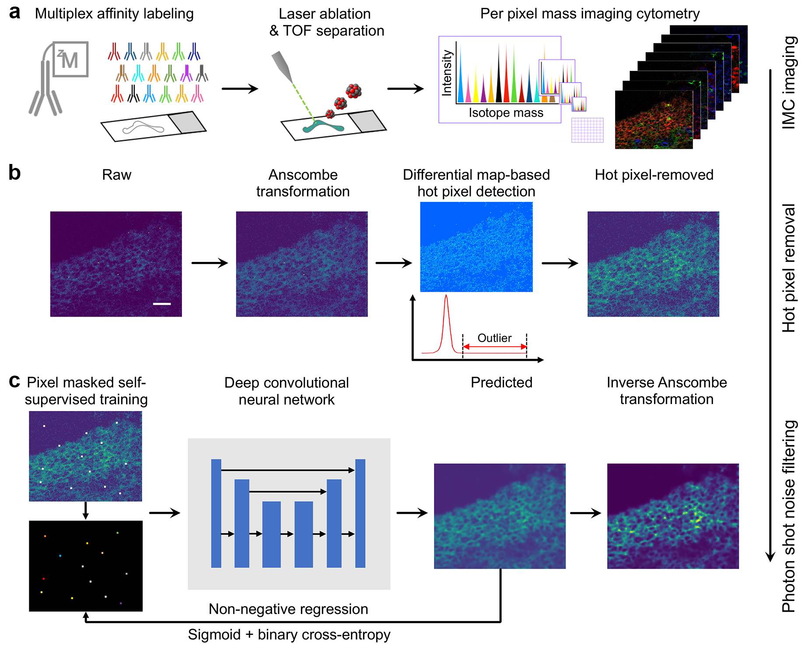

# IMC-Denoise: a content aware denoising pipeline to enhance Imaging Mass Cytometry



Imaging Mass Cytometry (IMC) is an emerging multiplexed imaging technology for analyzing complex microenvironments that has the ability to detect the spatial distribution of at least 40 cell markers. However, this new modality has unique image data processing requirements, particularly when applying this
technology to patient tissue specimens. In these cases, signal-to-noise ratio (SNR) for particular markers can be low despite optimization of staining conditions, and the presence of pixel intensity artifacts can deteriorate image quality and the performance of downstream analysis. Here we demonstrate a content aware
pipeline, IMC-Denoise, to restore IMC images. Specifically, we deploy a **D**ifferential **I**ntensity **M**ap-based **R**estoration (**DIMR**) algorithm for removing hot pixels and a self-supervised **Deep** learning algorithm for **S**hot **N**oise **F**iltering (**DeepSNF**). IMC-Denoise enables adaptive hot pixel removal without loss of resolution and delivers significant SNR improvement to a diverse set of IMC channels and datasets. Here we show how to implement IMC-Denoise and develop the software package **IMC_Denoise**. We hope this package could help the researchers in the field of mass cytometry imaging.

## Contents

- [Directory structure of IMC_Denoise](#directory-structure-of-imc_denoise)
- [Customize environment for IMC_Denoise](#customize-environment-for-imc_denoise)
  - [Our IMC_Denoise environment](#our-imc_denoise-environment)
  - [Installation](#installation)
- [Implement IMC_Denoise](#implement-imc_denoise)
  - [Directory structure of raw IMC images](#directory-structure-of-raw-imc-images) 
  - [Download example data](#download-example-data)
  - [IMC_Denoise tutorials with Jupyter Notebook](#imc_denoise-tutorials-with-jupyter-notebook)
  - [Implement IMC_Denoise with scripts](#implement-imc_denoise-with-scripts)
- [License](#license)
- [Contact](#contact)
- [References](#references)

## Directory structure of IMC_Denoise
```
IMC_Denoise
|---IMC_Denoise
|---|---IMC_Denoise_main
|---|---|---DIMR.py
|---|---|---DeepSNF.py
|---|---|---DeepSNF_model.py
|---|---|---loss_functions.py
|---|---DeepSNF_utils
|---|---|---DeepSNF_DataGenerator.py
|---|---|---DeepSNF_TrainGenerator.py
|---|---Anscombe_transform
|---|---|---Anscombe_transform_functions.py
|---|---|---Anscombe_vectors.mat
|---Jupyter_Notebook_examples
|---|---IMC_Denoise_Train_and_Predict.ipynb
|---|---IMC_Denoise_Train.ipynb
|---|---IMC_Denoise_Predict.ipynb
|---scripts
|---|---Data_generation_DeepSNF_script.py
|---|---Training_DeepSNF_script.py
|---|---Generate_data_and_training_DeepSNF_script.py
|---|---Predict_DIMR_script.py
|---|---Predict_IMC_Denoise_script.py
```
- **IMC_Denoise** implements DIMR and DeepSNF algorithms to remove hot pixels and filter shot noise in IMC images, respectively.
- **scripts** and **Jupyter Notebooks** include several examples to implement IMC_Denoise algorithms.

## Customize environment for IMC_Denoise
### Our IMC_Denoise environment
- Windows 10 64bit
- Python 3.6
- Tensorflow 2.2.0
- Keras 2.3.1
- NVIDIA GPU (24 GB Memory) + CUDA
- We run all the codes in a Anaconda Powershell Prompt

### Installation
- Create a virtual environment and install tensorflow-gpu and keras.
```
$ conda create -n 'IMC_Denoise' python=3.6
$ conda activate IMC_Denoise
$ conda install -c anaconda brotlipy
$ pip install tensorflow-gpu==2.2.0 keras==2.3.1
$ conda install -c anaconda cudnn 
$ conda install -c anaconda cudatoolkit=10.1 
```
- Download the source code and install the package
```
$ git clone https://github.com/PENGLU-WashU/IMC_Denoise.git
$ cd IMC_Denoise
$ pip install -e .
```

## Implement IMC_Denoise
### Directory structure of raw IMC images
In order to generate a training set for DeepSNF, the directory structure of raw IMC images must be arranged as follows.
```
|---Raw_image_directory
|---|---Tissue1_sub_directory
|---|---|---Channel1_img.tiff
|---|---|---Channel2_img.tiff
             ...
|---|---|---Channel_n_img.tiff
|---|---Tissue2_sub_directory
|---|---|---Channel1_img.tiff
|---|---|---Channel2_img.tiff
             ...
|---|---|---Channel_n_img.tiff
             ...
|---|---Tissue_m_sub_directory
|---|---|---Channel1_img.tiff
|---|---|---Channel2_img.tiff
             ...
|---|---|---Channel_n_img.tiff
```
### Download example data

### IMC_Denoise tutorials with Jupyter Notebook
- To start Jupyter Notebooks and run the examples.
```
$ conda activate IMC_Denoise
$ jupyter notebook --notebook-dir=your_folder_of_notebook_examples
```
- Train and predict the DeepSNF algorithm separately, in which the generated dataset and trained weights will be saved.
  - [DeepSNF: generate data and training](https://github.com/PENGLU-WashU/IMC_Denoise/blob/main/Jupyter_Notebook_examples/IMC_Denoise_Train.ipynb)
  - [IMC_Denoise: remove hot pixels with DIMR and filter shot noise with the pre-trained model of DeepSNF](https://github.com/PENGLU-WashU/IMC_Denoise/blob/main/Jupyter_Notebook_examples/IMC_Denoise_Predict.ipynb)
- Train and predict the DeepSNF algorithm in the same notebook, in which the generated dataset and trained weights will not be saved.
  - [IMC_Denoise: remove hot pixels with DIMR and filter shot noise with the onsite training of DeepSNF](https://github.com/PENGLU-WashU/IMC_Denoise/blob/main/Jupyter_Notebook_examples/IMC_Denoise_Train_and_Predict.ipynb)

### Implement IMC_Denoise with scripts
- Here we take CD38 channel as an example. In this case, the "channel_name" should be set as its corresponding channel "141Pr".
- Activate the IMC_Denoise environment.
```
$ conda activate IMC_Denoise
```
- Generating training set and train a DeepSNF model.
  - Generate training set of a specific marker channel for DeepSNF. The generated training data will be saved in a sub-directory "Generated_training_set" of the current folder other than setting a customized folder. For CD38, the saved name will be "training_set_141Pr.npz".
  ```
  python scripts/Data_generation_DeepSNF_script.py --channel_name '141Pr' --Raw_directory 'Your_raw_img_directory'  --n_neighbours '4' --n_lambda '5' --slide_window_size '3'
  ```
  - Train a DeepSNF network. The generated training set will be loaded from a default folder other than choosing a customized folder. The trained weights will be saved in a sub-directory "trained_weights" of the current folder other than setting a customized folder. Hyper-parameters can be adjusted. Note that when implementing prediction, input the same "trained_weights" name.
  ```
  python scripts/Training_DeepSNF_script.py --train_set_name 'training_set_141Pr.npz' --weights_name 'weights_141Pr-CD38.hdf5' --train_epoches '50' --train_batch_size '128'
  ```
  - Generate training set for a specific marker channel and then train a DeepSNF network. In this process, the generated training set will not be saved in a directory.
  ```
  python scripts/Generate_data_and_training_DeepSNF_script.py --channel_name '141Pr' 
                                                              --weights_name 'weights_141Pr-CD38.hdf5'
                                                              --Raw_directory 'Your_raw_img_directory'
                                                              --train_epoches '50' 
                                                              --train_batch_size '128'
                                                              --n_neighbours '4' --n_lambda '5' --slide_window_size '3'
  ```                                             
- Implement IMC_Denoise to enhance IMC images.
  - Implement DIMR for a single IMC image if the SNR of the image is good.
  ```
  python scipts/Predict_DIMR_script.py --Raw_img_name 'your_raw_img_name(.tiff)' 
                                       --Denoised_img_name 'your_denoised_img_name(.tiff)' 
                                       --n_neighbours '4' --n_lambda '5' --slide_window_size '3'
  ```
  - Implement IMC_Denoise including DIMR and DeepSNF for a single IMC image if the image is contaminated by hot pixels and suffers from low SNR. The trained weights will be loaded from the default directory other than choosing a customized folder. 
  ```
  python scripts/Predict_IMC_Denoise_script.py --Raw_img_name 'your_raw_img_name(.tiff)' 
                                               --Denoised_img_name 'your_denoised_img_name(.tiff)' 
                                               --weights_name 'weights_141Pr-CD38.hdf5'   
                                               --n_neighbours '4' --n_lambda '5' --slide_window_size '3' 
  ```
- More specific parameters can also be added and adjusted. Please refer to the scripts files.

## License

## Contact

Peng Lu - [@penglu10](https://twitter.com/penglu10) - penglu@wustl.edu
<br/>Project Link: [https://github.com/PENGLU-WashU/IMC_Denoise](https://github.com/PENGLU-WashU/IMC_Denoise)
<br/>Lab Website: [Thorek Lab WashU](https://sites.wustl.edu/thoreklab/)

## References
